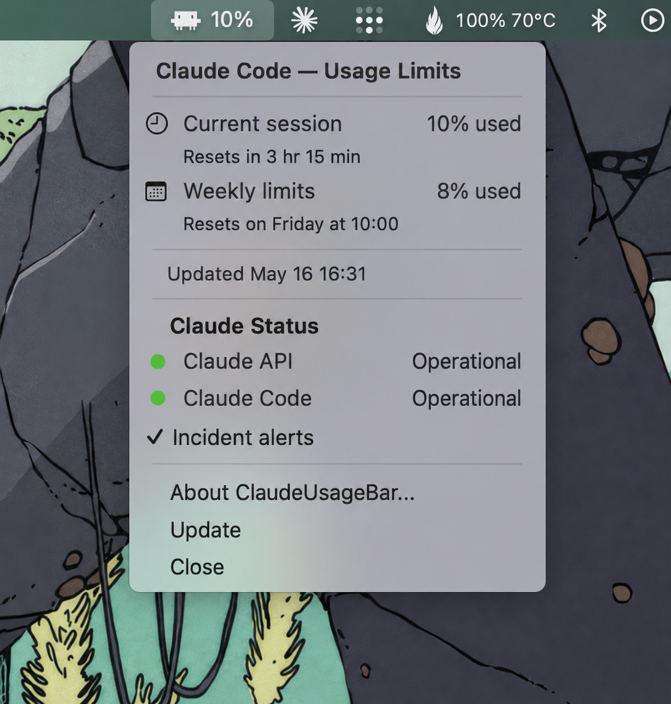

Claude Code plan usage in your macOS menu bar.

Independent project. Not affiliated with, endorsed by, or sponsored by Anthropic, Claude, or Claude Code.



## What it does

ClaudeUsageBar shows your Claude Code usage in the macOS menu bar, including the current session, weekly usage, and reset times.

Open it once, keep it in the menu bar, and check your usage without opening Claude settings.

---

## Requirements

- macOS 13+
- [Claude Code](https://claude.ai/code) with a Pro or Team subscription

---

## Install

### Download the DMG

Download `ClaudeUsageBar.dmg` from the [latest release](https://github.com/ChrisPiz/Claude-Code-Usage-Bar/releases/latest), open it, and drag `ClaudeUsageBar.app` to `Applications`.

Open the app once. It configures Claude Code automatically.

Restart Claude Code, then send any message. The menu bar percentage updates after Claude Code returns usage data.

If you already have a custom Claude Code `statusLine`, the app will not overwrite it.

Unsigned local builds may require right-click → Open. Public releases should be signed and notarized.

---

## Auto-start on login

Add the app to Login Items so it launches automatically:

**System Settings → General → Login Items → +** → select `/Applications/ClaudeUsageBar.app`

---

## Advanced

If you already have a custom `statusLine` script, the app won't overwrite it. Add this snippet to your existing script:

```bash
# claude-usage-bar state update
USAGE_BAR="/Applications/ClaudeUsageBar.app/Contents/MacOS/ClaudeUsageBar"
if [ -x "$USAGE_BAR" ]; then
  cat | "$USAGE_BAR" --statusline >/dev/null
  printf '%s\n' "$your_existing_output"
fi
```

---

## Building a DMG

For maintainers:

```bash
bash build.sh
```

The build writes:

- `dist/ClaudeUsageBar.app`
- `dist/ClaudeUsageBar.dmg`

Set `CODE_SIGN_IDENTITY` to sign with a Developer ID certificate. Without it, the app is ad-hoc signed for local testing.

---

## Uninstall

Quit `ClaudeUsageBar`, delete it from `Applications`, and remove the `statusLine` entry from `~/.claude/settings.json`.

---

## License

MIT
